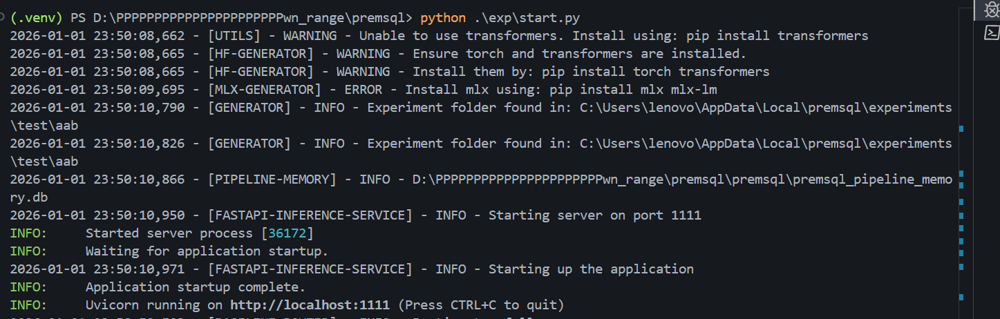

# RCE via Unsafe `eval()` in `BaseLineFollowupWorker`

## Summary (摘要)
A Remote Code Execution (RCE) vulnerability exists in the `premsql` library due to the unsafe usage of `eval()` on language model outputs. An attacker can use prompt injection to force the LLM to output malicious Python code, which is then executed by the server.

`premsql` 库中存在一个远程代码执行 (RCE) 漏洞，原因是直接对语言模型的输出使用了不安全的 `eval()` 函数。攻击者可以通过提示注入 (Prompt Injection) 诱导 LLM 输出恶意的 Python 代码，从而在服务器上执行该代码。

## Vulnerability Details (漏洞详情)

**File (文件):** `premsql/agents/baseline/workers/followup.py`
**Code Snippet (代码片段):**

```python
        try:
            result = self.generator.generate(
                data_blob={"prompt": prompt},
                temperature=temperature,
                max_new_tokens=max_new_tokens,
                postprocess=False,
            )
            # VULNERABILITY HERE:
            result = eval(result.replace("null", "None"))
            error_from_model = None
            assert "alternate_decision" in result
            assert "suggestion" in result
```

The `result` variable contains the raw string output from the LLM. The application attempts to parse this as a Python dictionary using `eval()`. However, if the LLM output is manipulated to contain valid Python commands (e.g., `__import__('os').system('calc')`), `eval()` will execute them.

变量 `result` 包含了 LLM 的原始字符串输出。应用程序尝试使用 `eval()` 将其解析为 Python 字典。然而，如果 LLM 的输出被操控包含有效的 Python 命令（例如 `__import__('os').system('calc')`），`eval()` 将会执行这些命令。

## Reproduction (复现步骤)

**Environment Setup (环境搭建):**
Start the vulnerable server using the provided example script:
运行提供的示例脚本启动受漏洞影响的服务器：

```
import os
from dotenv import load_dotenv
from premsql.playground import AgentServer
from premsql.agents import BaseLineAgent
from premsql.generators import Text2SQLGeneratorOllama,Text2SQLGeneratorOpenAI
from premsql.executors import ExecutorUsingLangChain
from premsql.agents.tools import SimpleMatplotlibTool
import ollama
import time
ollama.Client = ollama.Client          # 这一行即可
load_dotenv()

text2sql_model = Text2SQLGeneratorOpenAI("gpt-4.1-mini","aab",type="test",openai_api_key="sk-0QKtXdGiRpAhEJOXBt5fJwYJL15bonqxK1m9Vy4W93KSQhTF")
analyser_plotter_model = Text2SQLGeneratorOpenAI("gpt-4.1-mini","aab",type="test",openai_api_key="sk-0QKtXdGiRpAhEJOXBt5fJwYJL15bonqxK1m9Vy4W93KSQhTF")

# Enter your Database path here. Supported SQLite, Postgres, MySQL and an unique session name.
db_connection_uri = "sqlite:///test.db"
session_name = "a"+str(int(time.time()))

agent = BaseLineAgent(
    session_name=session_name,
    db_connection_uri=db_connection_uri,
    specialized_model1=text2sql_model,
    specialized_model2=analyser_plotter_model,
    executor=ExecutorUsingLangChain(),
    auto_filter_tables=False,
    plot_tool=SimpleMatplotlibTool()
)


agent_server = AgentServer(agent=agent, port=1111)
agent_server.launch()
```


```bash
python exp/start.py
```



**Exploitation (利用):**
Run the Proof of Concept script `poc.py`. This script sends a prompt injection payload that instructs the LLM to output `__import__('os').system('calc')`.
运行概念验证脚本 `poc.py`。该脚本发送一个提示注入载荷，指示 LLM 输出 `__import__('os').system('calc')`。

```bash
python poc.py
```

**Result (结果):**
The Calculator application (`calc.exe`) will launch on the server host, confirming arbitrary code execution.
服务器主机上将启动计算器应用程序 (`calc.exe`)，证实了任意代码执行。


## Remediation (修复建议)

**Do not use `eval()` to parse data.** Use `json.loads()` instead to safely parse JSON strings. Ensure the Prompt instructs the LLM to output valid JSON.

**不要使用 `eval()` 解析数据。** 应使用 `json.loads()` 来安全地解析 JSON 字符串。同时确保提示 (Prompt) 指示 LLM 输出有效的 JSON 格式。

**Patch Example (修复示例):**

```python
import json

# ...

        try:
            result_str = self.generator.generate(
                data_blob={"prompt": prompt},
                temperature=temperature,
                max_new_tokens=max_new_tokens,
                postprocess=False,
            )
            
            # Use json.loads instead of eval
            # You may need to ensure the model outputs valid JSON, possibly using a JSON repair tool if needed
            result = json.loads(result_str)
            
            error_from_model = None
            assert "alternate_decision" in result
            assert "suggestion" in result
```
